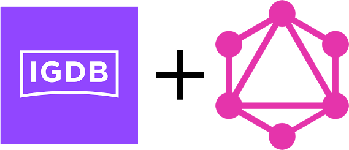

<p align="center">
  <a href="https://github.com/Don-Cryptus/traefik">
    
  </a>

  <p align="center">
    <h1 align="center">igdb-graphql</h1>

  <p align="center">
    <a  href="https://studio.apollographql.com/sandbox/explorer?endpoint=https://igdb.coding.global/">Test it out</a>
    ·
    <a  href="https://github.com/Don-Cryptus/igdb-graphql/issues">Report Bug</a>
    ·
    <a href="https://github.com/Don-Cryptus/igdb-graphql/issues">Request Feature</a>
  </p>

</p>

IGDB.com wrapper Graphql API with working relation fetch.

## About The Project

Currently only games inputs finished, everything else works fine feel free to add more to it.


## [Test the queries here](https://studio.apollographql.com/sandbox/explorer?endpoint=https://igdb.myngz.com/)

## Examples

### 1. Simple
- **Query**
```graphql
query Games($where: GamesWhereInput) {
  games(where: $where) {
      id
        follows
        hypes
        name
        status
  }
}
```
- **Variables**
```json
{
"where": {
  "name": {
    "contains": "god"
  }
}
}
```
### 2. Advanced
- **Query**
```graphql
query Games($where: GamesWhereInput, $sort: GamesSortInput, $limit: Int, $offset: Int) {
  games(where: $where, sort: $sort, limit: $limit, offset: $offset) {
    id
    follows
    hypes
    name
    status
  }
}
```
- **Variables**
```json
{
  "where": {
    "AND": [
      {
        "follows": {
          "gt": 100
        },
        "hypes": {
          "gt": 100
        },
        "OR": [
          {
            "status": {
              "equals": null
            }
          }
        ]
      }
    ]
  },
  "sort": {
    "id": "asc"
  },
  "limit": 100,
  "offset": 10
}
```
### 3. Relations
- **Query**
```graphql
query Games {
  games {
    id
    follows
    hypes
    name
    status
    artworks {
      id
      url
      width
      height
    }
    cover {
      id
      url
      image_id
      width
      height
    }
  }
}
```
